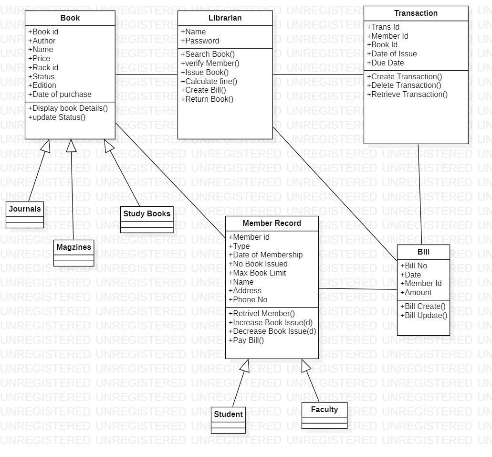

# Exp - 2 LIBRARY MANAGEMENT SYSTEM

# AIM:
To create UML diagrams for a Library Management System.
# SRS (Procedure):
Create the following diagrams in StarUML:
1) Use Case Diagram
2) Class Diagram
3) Activity Diagram
4) Package Diagram
5) Communication Diagram
6) Sequence Diagram
# DIAGRAMS:
USECASE DIAGRAM

CLASS DIAGRAM

ACTIVITY DIAGRAM

COMMUNICATION DIAGRAM

PACKAGE DIAGRAM

SEQUENCE DIAGRAM

# RESULT:
Thus, the UML diagrams for Library Management System has been created successfully.